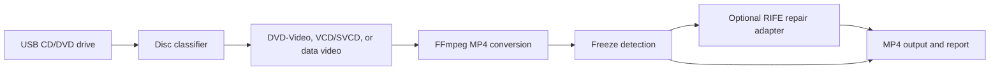

<p align="center">
  
</p>

<h1 align="center">RawCD</h1>

<p align="center">
  A Linux-first restoration desk for converting personal, unprotected CD/DVD video media into MP4 files.
</p>

<p align="center">
  
  
  
  
</p>

## What RawCD Does

RawCD turns a USB CD/DVD drive and a personal disc archive into a local conversion workflow. It inspects the mounted disc, identifies playable clips, converts each source to MP4, and records what repair work was attempted.

It is intentionally scoped to personal, unprotected media. RawCD does not bypass DVD encryption, copy protection, or access controls.

## Interface Direction

RawCD uses a typographic restoration-lab design: pure white workspace, moss-green primary actions, correction-color state marks, and a compact clip ledger. The interface is built for repeatable work, not marketing spectacle.

| Surface | Purpose |
| --- | --- |
| Source proof | Scan Linux optical drives and inspect mounted media paths. |
| Clip ledger | Review detected video sources before conversion. |
| Repair controls | Enable AI repair and preserve-quality output settings. |
| Engine ledger | Track scan, inspection, conversion, warnings, and output paths. |

## Conversion Pipeline



## Features

| Area | Current capability |
| --- | --- |
| Device scanning | Uses `lsblk` to find Linux optical drives and mounted media. |
| Disc inspection | Detects DVD-Video, VCD/SVCD, and data-video layouts. |
| Conversion | Creates one high-quality H.264/AAC MP4 per detected source. |
| Audio | Preserves the primary audio stream when present. |
| Protection handling | Refuses protected or encrypted discs with a clear message. |
| Repair analysis | Runs FFmpeg `freezedetect` to find frozen ranges. |
| AI repair adapter | Provides installer-managed `rife-ncnn-vulkan` support for interpolation workflows. |
| Desktop package | Builds a Tauri `.deb` package for Ubuntu-compatible Linux desktops. |

## Architecture

```text
RawCD
├── src/                 TypeScript UI and Tauri command client
├── src-tauri/           Tauri shell, Rust command bridge, desktop packaging
├── rawcd/               Python media engine, API, FFmpeg, repair adapters
├── tests/               Python unit and integration-style tests
├── PRODUCT.md           Product register and strategic design context
└── DESIGN.md            Visual system and UI design contract
```

The Tauri shell launches the local Python engine on `127.0.0.1:8765`, then proxies desktop commands through the engine API.

## Requirements

- Ubuntu 22.04 or compatible Linux desktop.
- USB CD/DVD drive for real-disc validation.
- `ffmpeg` and `ffprobe` on `PATH`.
- Python 3.10 or newer.
- Node.js and npm.
- Rust and Cargo.
- Tauri Linux build dependencies.

## Development

Install dependencies:

```bash
npm install
```

Run the test suite:

```bash
pytest -q
npm test
cargo test --manifest-path src-tauri/Cargo.toml
```

Build the web UI:

```bash
npm run build
```

Build the Linux desktop package:

```bash
npm run tauri build
```

The generated Debian package is written to:

```text
src-tauri/target/release/bundle/deb/RawCD_0.1.0_amd64.deb
```

## Running the Engine Directly

```bash
python3 -m rawcd.server --host 127.0.0.1 --port 8765
```

Useful API endpoints:

| Endpoint | Method | Purpose |
| --- | --- | --- |
| `/health` | GET | Engine readiness check. |
| `/scan_devices` | GET | List optical drives and mounted media. |
| `/inspect_disc` | POST | Classify a mounted disc path. |
| `/start_conversion` | POST | Start an MP4 conversion job. |
| `/get_job_status/{job_id}` | GET | Read progress, warnings, outputs, and report data. |
| `/cancel_job/{job_id}` | POST | Request cancellation. |

## Security Posture

RawCD is a local-first desktop app. The engine binds to loopback only by default and the UI is designed for personal media workflows.

Important boundaries:

- No DRM bypass.
- No remote upload path.
- No cloud processing.
- No credentials required.
- No privileged system writes beyond normal user-selected output folders.
- AI repair tooling is downloaded only when the repair adapter is used.

## Verification Status

The repository includes automated coverage for:

- Disc classification.
- FFmpeg command construction and protected-media error handling.
- Job lifecycle states.
- Device scanner parsing.
- FastAPI endpoint behavior.
- RIFE installer and interpolation command construction.
- Tauri bridge utility behavior.
- Frontend command-client and state helpers.

Real USB-drive acceptance testing still requires a USB optical drive and an unprotected personal disc.
