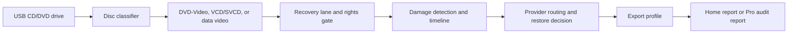

<p align="center">
  
</p>

<h1 align="center">RawCD</h1>

<p align="center">
  A Linux-first restoration desk for recovering personal CD/DVD video media with Home and Pro restore workflows.
</p>

<p align="center">
  
  
  
  
</p>

## What RawCD Does

RawCD turns a USB CD/DVD drive and a personal disc archive into a local restoration workflow. It inspects mounted media, identifies playable clips, tracks recovery and frame-damage state, exports restored video, and writes reports that describe the restoration decisions.

RawCD has two lanes:

| Lane | Intended use |
| --- | --- |
| Home Restore | Personal, unprotected media with MP4 output and a local restoration report. |
| Studio / Pro | Approved rights-holder projects with rights declarations, archival export profiles, WAV sidecars, provider routing, and Pro audit reports. |

RawCD does not bypass DVD encryption, copy protection, region controls, DRM, or access controls.

## Interface Direction

RawCD uses a typographic restoration-lab design: pure white workspace, moss-green primary actions, correction-color state marks, and a compact clip ledger. The interface is built for repeatable work, not marketing spectacle.

| Surface | Purpose |
| --- | --- |
| Source proof | Scan Linux optical drives and inspect mounted media paths. |
| Clip ledger | Review detected video sources before conversion. |
| Restore controls | Choose Quick or Maximum Recovery and Faithful or Enhanced Restore. |
| Live preview | Track current restore operation, frame, timestamp, and preview image when available. |
| Pro workflow | Capture verification profile, rights declaration, export profile, WAV sidecar preference, and provider routing. |
| Report ledger | Track Home reports, Pro audit reports, warnings, output paths, and generated files. |

## Conversion Pipeline



## Features

| Area | Current capability |
| --- | --- |
| Device scanning | Uses `lsblk` to find Linux optical drives and mounted media. |
| Disc inspection | Detects DVD-Video, VCD/SVCD, and data-video layouts. |
| Home restore | Creates high-quality H.264/AAC MP4 output for personal media. |
| Pro restore | Supports ProRes 422 HQ, DNxHR HQX, FFV1 MKV, and optional WAV sidecar extraction. |
| Recovery modes | Supports Quick Recovery and Maximum Recovery request paths. |
| Restore modes | Supports Faithful Restore and Enhanced Restore; Enhanced Restore applies conservative FFmpeg cleanup filters for Home MP4 exports. |
| Protection handling | Refuses protected Home media and gates Pro workflows behind verification and rights metadata. |
| Repair analysis | Runs FFmpeg `freezedetect`, maps damaged ranges, and records frame-state timelines. |
| Provider routing | Exposes local, Ollama, Topaz, and cloud-provider configuration and health checks. |
| Live preview | Tracks job-bound restore operation, frame, timestamp, and preview image URL when generated. |
| Reports | Writes Home JSON reports and Pro JSON/Markdown audit reports with sensitive values redacted. |
| Desktop package | Builds a Tauri `.deb` package for Ubuntu-compatible Linux desktops. |

## Architecture

```text
RawCD
├── src/                 TypeScript UI and Tauri command client
├── src-tauri/           Tauri shell, Rust command bridge, desktop packaging
├── rawcd/               Python media engine, API, FFmpeg, repair adapters
├── tests/               Python unit and integration-style tests
├── PRODUCT.md           Product register and strategic design context
└── DESIGN.md            Visual system and UI design contract
```

The Tauri shell launches the local Python engine on `127.0.0.1:8765`, then proxies desktop commands through the engine API.

## Requirements

- Ubuntu 22.04 or compatible Linux desktop.
- USB CD/DVD drive for real-disc validation.
- `ffmpeg` and `ffprobe` on `PATH`.
- Python 3.10 or newer.
- Node.js 20.19+ or 22.12+.
- npm.
- Rust and Cargo.
- Tauri Linux build dependencies.

## Prior Setup

RawCD is currently easiest to run from source on Ubuntu or another Debian-based Linux desktop. The desktop app starts a local Python engine on `127.0.0.1:8765`, so the Python package and media tools must be available on the same machine.

Install system, media, and Tauri Linux packages:

```bash
sudo apt update
sudo apt install \
  ffmpeg \
  python3 \
  python3-venv \
  python3-pip \
  nodejs \
  npm \
  cargo \
  libwebkit2gtk-4.1-dev \
  build-essential \
  curl \
  wget \
  file \
  libxdo-dev \
  libssl-dev \
  libayatana-appindicator3-dev \
  librsvg2-dev
```

The Tauri packages match the [official Tauri Linux prerequisites](https://v2.tauri.app/start/prerequisites/).

If your distribution provides an older Node.js package, install a current Node.js runtime with your preferred version manager before running `npm install`. Ubuntu 22.04's default `nodejs` package is usually too old for this project. If `cargo --version` is also too old, install Rust with `rustup` or another current Rust toolchain manager.

Install project dependencies from the repository root:

```bash
python3 -m venv .venv
source .venv/bin/activate
python -m pip install --upgrade pip
python -m pip install -e ".[dev]"
npm install
```

Check that the required tools are available:

```bash
python3 --version
node --version
npm --version
cargo --version
ffmpeg -version
ffprobe -version
```

Prepare a disc before launching RawCD:

1. Connect a USB CD/DVD drive.
2. Insert a personal, unprotected disc.
3. Mount the disc through your file manager, or mount it from the terminal:

```bash
lsblk -o NAME,TYPE,RM,MODEL,MOUNTPOINTS
udisksctl mount -b /dev/sr0
```

Replace `/dev/sr0` if your optical drive uses a different device path.

## User Manual

Run the full desktop app from the repository root:

```bash
source .venv/bin/activate
npm run tauri -- dev
```

The Tauri shell opens the RawCD window, starts the local engine if it is not already running, and connects the interface to the engine API.

Use RawCD in this order:

1. Insert and mount the disc.
2. Select **Scan drives**. RawCD reads Linux optical-drive data through `lsblk`.
3. Choose the detected mounted source. If the drive is not listed, enter the mount point in **Manual mount path**, for example `/media/user/MY_DISC`.
4. Select **Inspect media**. RawCD classifies the disc as DVD-Video, VCD/SVCD, data video, or unknown.
5. Review the clip ledger. RawCD lists each playable source it found before conversion starts.
6. Choose **Home Restore** for personal MP4 output, or **Studio / Pro** for approved rights-holder work.
7. Choose **Quick Recovery** or **Maximum Recovery**.
8. Choose **Faithful Restore** or **Enhanced Restore**.
9. Choose the output folder. The default is `~/Videos/RawCD`.
10. For Home Restore, select **Start Home Restore**. RawCD writes MP4 output and a `.rawcd-home-report.json` sidecar report.
11. For Studio / Pro, complete the Pro verification profile and rights declaration, then choose the export profile: ProRes 422 HQ, DNxHR HQX, or FFV1 MKV.
12. Enable **Extract WAV audio sidecar** when a Pro project needs separate PCM audio.
13. Use the provider routing controls to enable or test available enhancement providers.
14. Watch the progress bar, live preview panel, timeline markers, report panel, and engine ledger for status, warnings, output paths, and errors.
15. Use **Cancel** to request cancellation while a job is running.
16. Use **Open output** or the report open controls after a completed job to open generated files.

RawCD creates unique filenames if the output folder already contains a file with the same name.

## Preview Without Desktop Shell

For a browser-only preview, run the engine and Vite in separate terminals.

Terminal 1:

```bash
source .venv/bin/activate
python3 -m rawcd.server --host 127.0.0.1 --port 8765
```

Terminal 2:

```bash
npm run dev -- --host 127.0.0.1
```

Open:

```text
http://127.0.0.1:1420/
```

In browser preview mode, **Open output** does not launch the file manager because that action is only available inside the Tauri desktop shell.

## Troubleshooting

| Problem | What to check |
| --- | --- |
| No drive appears after scanning | Confirm the disc is mounted and visible in `lsblk -o NAME,TYPE,MODEL,MOUNTPOINTS`. |
| Manual path fails | Confirm the path exists and points to the mounted disc root, not the device path. |
| Conversion fails immediately | Confirm `ffmpeg` and `ffprobe` are installed and available on `PATH`. |
| Protected-media error | RawCD does not bypass encryption, CSS, DRM, or copy protection. Use only personal, unprotected media. |
| Home restore refuses a source | Confirm the source is personal and unprotected. Home Restore is intentionally blocked for protected media. |
| Pro restore stays locked | Save a complete Pro profile, obtain approved verification status, and fill every rights-declaration field. |
| Provider test fails | Confirm the provider binary, service, license, local model, API key, or network access required by that provider. |
| Browser preview cannot connect | Start `python3 -m rawcd.server --host 127.0.0.1 --port 8765` before opening the Vite URL. |
| Desktop app cannot start engine | Activate the Python environment and confirm `python3 -m rawcd.server` works from the repository root. |
| Preview frame is blank | RawCD still reports job state when no preview JPEG has been generated yet. |

## What RawCD Lacks Today

- RawCD does not bypass DVD encryption, CSS, DRM, region controls, or copy protection.
- RawCD does not mount discs by itself. The operating system must mount the disc first.
- RawCD does not repair unreadable sectors or physically damaged media. It depends on the drive, operating system, and FFmpeg being able to read the source.
- The current conversion model creates file exports from detected sources. It does not preserve DVD menus, chapters, subtitle tracks, alternate audio tracks, or title navigation.
- DVD handling is file-oriented. It does not yet combine multi-file DVD title sets into one title-aware output.
- Enhancement providers must be installed, licensed, configured, and available separately. RawCD routes to them and records decisions; it does not bundle paid or third-party AI models.
- Pro verification is a local workflow gate in this build. Server-side approval updates require a configured `RAWCD_PRO_VERIFICATION_TOKEN`.
- The app is Linux-first. macOS and Windows packages are not provided.
- The generated Debian package is suitable for local packaging checks, but the app is not yet a fully self-contained installer for a clean machine because the Python engine and external media tools still need setup.
- Real USB-drive acceptance testing still requires a USB optical drive and an unprotected personal disc.

## Development

Run the test suite:

```bash
pytest -q
npm test
cargo test --manifest-path src-tauri/Cargo.toml
```

Build the web UI:

```bash
npm run build
```

Build the Linux desktop package:

```bash
npm run tauri build
```

The generated Debian package is written to:

```text
src-tauri/target/release/bundle/deb/RawCD_0.1.0_amd64.deb
```

## Running the Engine Directly

```bash
python3 -m rawcd.server --host 127.0.0.1 --port 8765
```

Useful API endpoints:

| Endpoint | Method | Purpose |
| --- | --- | --- |
| `/health` | GET | Engine readiness check. |
| `/scan_devices` | GET | List optical drives and mounted media. |
| `/inspect_disc` | POST | Classify a mounted disc path. |
| `/start_conversion` | POST | Start an MP4 conversion job. |
| `/get_job_status/{job_id}` | GET | Read progress, warnings, outputs, and report data. |
| `/cancel_job/{job_id}` | POST | Request cancellation. |

Example inspection request:

```bash
curl -X POST http://127.0.0.1:8765/inspect_disc \
  -H "Content-Type: application/json" \
  -d '{"path":"/media/user/MY_DISC"}'
```

## Security Posture

RawCD is a local-first desktop app. The engine binds to loopback only by default and the UI is designed for personal media workflows.

Important boundaries:

- No DRM bypass.
- No remote upload path.
- No cloud processing.
- No credentials required.
- No privileged system writes beyond normal user-selected output folders.
- AI repair tooling is downloaded only when the repair adapter is used.

## Verification Status

The repository includes automated coverage for:

- Disc classification.
- FFmpeg command construction and protected-media error handling.
- Job lifecycle states.
- Device scanner parsing.
- FastAPI endpoint behavior.
- RIFE installer and interpolation command construction.
- Tauri bridge utility behavior.
- Frontend command-client and state helpers.

Real USB-drive acceptance testing still requires a USB optical drive and an unprotected personal disc.
